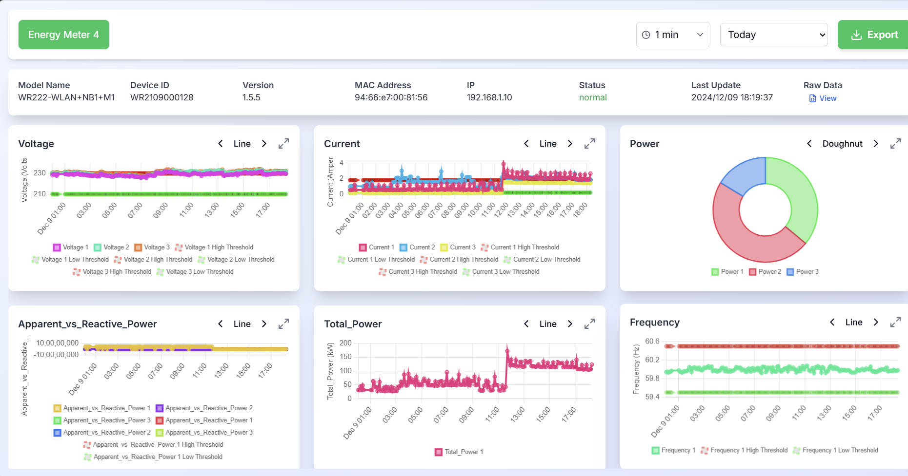
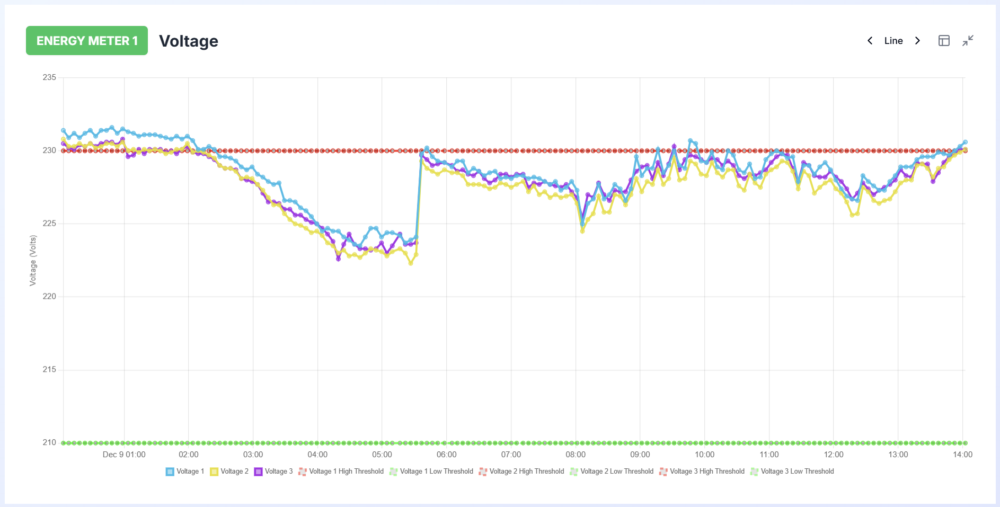

# IoT3 Data Validation and Visualisation

_A real-time data visualization platform for monitoring and analyzing energy meter data._


*Figure 1: User Interface Overview*


*Figure 2: Fullscreen Chart Visualization*

---


## Table of Contents

- [Description](#description)
- [Features](#features)
- [Tech Stack](#tech-stack)
- [Installation](#installation)
- [Usage](#usage)
- [Workflow](#workflow)
  - [Dashboard Workflow](#1-dashboard-workflow)
  - [Component Workflow](#2-component-workflow)
- [API Documentation](#fastapi-workflow-documentation)
- [Contributing](#contributing)
- [License](#license)

---

## Description

This project is a web-based dashboard that allows users to visualize and analyze data from multiple energy meters in real-time. It provides insights into power consumption, voltage, current, and other electrical parameters, helping users make informed decisions about energy usage and efficiency.

---

## Features

- Real-time data visualization for multiple energy meters
- Customizable date range selection for historical data analysis
- Interactive charts for voltage, current, power, and frequency
- Exportable data in CSV and JSON formats
- User-friendly interface with animated transitions

---

## Tech Stack

- **Frontend:** React.js, Next.js, Tailwind CSS
- **State Management:** Recoil
- **Charts:** Chart.js
- **Backend:** Python, FastAPI

---

## Installation

Follow these steps to set up the project locally:

```bash
# Clone the repository
git clone https://github.com/GD-DSCE/IoT3-DVV-Project.git

# Navigate to the project directory
cd src/main

# Install frontend dependencies
npm install

# In a new terminal, start the frontend development server
npm run dev
```

---

## Usage

1. Run `npm run dev` to start the frontend project.
2. Open [http://localhost:3000](http://localhost:3000) in the browser.
3. Select an energy meter from the dropdown.
4. Choose a date range for data analysis.
5. Explore the various charts and metrics displayed.
6. Use the export button to download data in CSV or JSON format.

---

# Workflow

---

## 1. Dashboard Workflow

**Description:** This workflow describes how the Dashboard component and its child components interact with each other to display real-time energy meter data.

**Steps:**
1. User selects an energy meter and date range in the dashboard.
2. Frontend sends a request to the backend API.
3. Backend fetches data from the database based on the selected parameters.
4. Data is processed and transformed in the backend.
5. Processed data is sent back to the frontend.
6. Frontend renders the data in various charts and displays.
7. User can interact with charts, change date ranges, or export data as needed.

---

## 2. Component Workflow

**Description:** This workflow outlines the functionality and interactions of individual components in the system.

### 1. [Home(src\main\app\page.js)](app/page.js)
**Description:** The Home **`[MYA001]`** component serves as the main entry point of the application. It's responsible for initializing the overall layout and rendering the Dashboard component.  
**Interaction:**
- Initializes the application's root structure.
- Renders the Dashboard component, passing any necessary props or context.
- May handle initial routing if the application has multiple pages.

---

### 2. [Dashboard(src\main\components\Dashboard.js)](components/Dashboard.js)
**Description:** The Dashboard component **`[MYA002]`** is the core container for the energy monitoring interface. It initializes the Recoil state management system and sets up the overall dashboard layout.  
**Interaction:**
- Wraps child components with `RecoilRoot` to provide state management context.
- Renders the `DashboardContent` **`[MYA003]`** component.
- May handle high-level state changes that affect multiple child components.
- Could implement error boundaries to catch and handle any errors in child components.

---

### 3. [DashboardContent(src\main\components\Dashboard.js)](components/Dashboard.js)
**Description:** DashboardContent **`[MYA003]`** is the main orchestrator of the dashboard's functionality. It manages the layout of various dashboard elements and coordinates data flow between components.  
**Interaction:**
- Renders `DateRangeDropdown` **`[MYA006]`**, `EnergyMeterDropdown` **`[MYA007]`**, `GraphLayout` **`[MYA008]`**, and `DeviceInfo` **`[MYA009]`** components.
- Utilizes `useFetchMeterData` **`[MYA010]`** hook to retrieve and manage meter data.
- Manages UI states such as loading indicators and error messages.
- Passes down relevant props and callbacks to child components.
- Handles animations for component mounting/unmounting using Framer Motion.

---

### 4. [DateRangeDropdown(src\main\components\DateRangeDropdown.js)](components/DateRangeDropdown.js)
**Description:** This `DateRangeDropdown` **`[MYA006]`** component provides a user interface for selecting a date range to filter the energy data.  
**Interaction:**
- Renders a dropdown with predefined date ranges and a custom date picker.
- Updates the `dateRangeState` **`[MYA004]`** in Recoil when a new range is selected.
- Triggers data fetching by updating the `shouldFetchDataState` **`[MYA005]`**.
- Provides visual feedback for the currently selected date range.
- Handles edge cases like invalid date selections or future dates.

---

### 5. [EnergyMeterDropdown(src\main\components\EnergyMeterDropdown.js)](components/EnergyMeterDropdown.js)
**Description:** This dropdown **`[MYA007]`** allows users to switch between different energy meters for data visualization.  
**Interaction:**
- Renders a list of available energy meters.
- Updates the `selectedMeter` **`[MYA011]`** state in Recoil when a new meter is chosen.
- Triggers data fetching for the newly selected meter.
- May implement a search or filter functionality for a large number of meters.
- Provides visual indication of the currently selected meter.

---

### 6. [GraphLayout(src\main\components\GraphLayout.js)](components/GraphLayout.js)
**Description:** GraphLayout **`[MYA008]`** is responsible for organizing and rendering various charts based on the selected meter and date range.  
**Interaction:**
- Uses the `graphConfig` **`[MYA012]`** state to determine which charts to display.
- Renders multiple `Card` **`[MYA013]`** components, each containing a specific chart.
- Handles the layout and responsiveness of the charts grid.
- Manages the fullscreen state of charts, allowing expansion/collapse.
- May implement drag-and-drop functionality for customizing chart positions.

---

### 7. [Card(src\main\components\Card.js)](components/Card.js)
**Description:** Card **`[MYA013]`** is a reusable component that encapsulates individual charts, providing a consistent layout and interaction model.  
**Interaction:**
- Renders either a `GeneralChart` **`[MYA014]`** or `DualYaxisChart` **`[MYA015]`** based on the chart type.
- Provides controls for toggling fullscreen mode and changing chart types.
- Handles loading states and displays appropriate loading indicators.
- May implement local caching to improve performance when switching between chart types.

---

### 8. [FullScreenCard(src\main\components\FullScreenCard.js)](components/FullScreenCard.js)
**Description:** FullScreenCard **`[MYA016]`** provides an expanded view of a selected chart, allowing for more detailed data analysis.  
**Interaction:**
- Renders a larger version of the selected chart.
- Provides additional controls or details not available in the regular Card view.
- Handles the transition animations between regular and fullscreen modes.
- May offer additional interaction options like zooming or data point selection.

---

### 9. [GeneralChart(src\main\components\charts\GeneralChart.js)](components/charts/GeneralChart.js) / [DualYaxis(src\main\components\charts\DualYaxis.js)](components/charts/DualYaxis.js)
**Description:** These components are responsible for rendering specific chart types (e.g., line, bar, pie, dual Y-axis charts) based on the provided data and configuration.  
**Interaction:**
- Processes raw data into the format required by the charting library.
- Renders the chart using a library like D3.js or Chart.js.
- Handles user interactions like hovering over data points or clicking on chart elements.
- Implements responsive design to adjust chart size based on container dimensions.
- May offer customization options for colors, axes, or data point styles.

---

### 10. [DeviceInfo(src\main\components\DeviceInfo.js)](components/DeviceInfo.js)
**Description:** DeviceInfo **`[MYA009]`** displays detailed information about the selected energy meter and its current status.  
**Interaction:**
- Fetches and displays device metadata from the Recoil state.
- Provides a button to view raw device data in a modal.
- Updates in real-time as new data is fetched or the selected meter changes.
- May implement collapsible sections for organizing large amounts of device information.

---

### 11. [Modal(src\main\components\DeviceInfo.js)](components/DeviceInfo.js)
**Description:** The Modal **`[MYA017]`** component provides a flexible, reusable overlay for displaying additional content or interactions.  
**Interaction:**
- Renders content (like raw device data) in an overlay above the main application.
- Handles opening and closing animations.
- Manages focus trapping for accessibility.
- Provides a close button and handles closing on outside clicks or escape key press.

---

### 12. [useFetchMeterData(src\main\hooks\useFetchMeterData.js)](hooks/useFetchMeterData.js)
**Description:** This custom useFetchMeterData hook **`[MYA010]`** encapsulates the logic for fetching and managing meter data based on the selected meter and date range.  
**Interaction:**
- Triggers API calls when `selectedMeter` **`[MYA018]`** or `dateRange` **`[MYA019]`** states change.
- Manages loading and error states during data fetching.
- Processes and formats the raw API response into a structure suitable for the application.
- Updates the `meterDataState` **`[MYA020]`** in Recoil with the fetched and processed data.
- May implement caching or debouncing to optimize API calls.

---

### 13. [useEnergyMeterStates(src\main\hooks\useEnergyMeterStates.js)](hooks/useEnergyMeterStates.js)
**Description:** This useEnergyMeterStates hook **`[MYA021]`** centralizes the management of various states related to energy meter selection and graph configuration.  
**Interaction:**
- Provides getter and setter functions for `selectedMeter` **`[MYA018]`**, `graphConfig` **`[MYA012]`**, and `fullScreenCard` **`[MYA022]`** states.
- Implements any complex state update logic that involves multiple state changes.
- May include derived state calculations based on the current state values.

---

### 14. [useExportMeterData(src\main\hooks\useExportMeterData.js)](hooks/useExportMeterData.js)
**Description:** This useExportMeterData hook **`[MYA023]`** handles the logic for exporting meter data in various formats.  
**Interaction:**
- Accepts parameters for the selected meter, date range, and export format.
- Triggers API calls to fetch export data.
- Manages loading and error states during the export process.
- Implements logic for downloading the data as CSV or JSON files.
- May include additional functionality for sending data to third-party services (e.g., email, cloud storage).

---

### 15. [DataTable(src\main\components\DataTable.js)](components/DataTable.js)
**Description:** The DataTable component **`[MYA024]`** dynamically displays tabular meter data based on the selected chart type and metric.  
**Interaction:**
- Uses **Recoil** states `meterDataState` **`[MYA020]`** and `chartConfigsState` **`   [MYA026]`** to fetch the meter data and chart configurations.
- Computes table rows and columns dynamically based on chart type and selected metrics.
- Provides a responsive UI with features like sorted headers and hover effects.
- Implements date formatting and nested value retrieval logic for structured data.

---

### 16. [PollingDropdown(src\main\components\PollingDropdown.js)](components/PollingDropdown.js)
**Description:** The PollingDropdown component **`[MYA025]`** provides a user interface for selecting the data polling interval dynamically.  
**Interaction:**
- Accepts `onIntervalChange` callback  to notify the parent component of the selected polling interval.
- Disables interaction when `isToday` is `false`, providing visual cues with opacity and cursor changes.
- Uses a Lucide-react clock icon and ChevronDown icon for better UI clarity.
- Allows interval selection ranging from 10 seconds to 10 minutes, with a `None` option to disable polling.
- Ensures accessibility with keyboard and focus-friendly designs.


# FastAPI Workflow Documentation

## Overview

This API provides services to fetch, transform, and export energy device data using FastAPI. The API consists of several endpoints and utility modules to fetch paginated device data, apply calibration and transformation logic, and export data in various formats (CSV/JSON).

---

## Project Structure

```plaintext
.
├── main.py             # Main entry point for the FastAPI app
├── extract.py          # Handles fetching data with pagination
├── export.py           # Handles exporting data in CSV/JSON formats
├── calibration.py      # Logic for scaling and calibrating device data
├── transform.py        # Data transformation logic
├── calibration.json    # Configuration file for scaling factors
├── thresholds.json     # Configuration file for threshold values
```

---

## Endpoints

### 1. `/fetch-and-transform`  
#### **Method:** `GET`  
#### **Description:** Fetches and transforms device data for a specific date range.  
#### **Query Parameters:**  
- `device_serial_number` (str): Serial number of the device.  
- `start_date` (str): Start date in ISO format (`YYYY-MM-DD`).  
- `end_date` (str): End date in ISO format (`YYYY-MM-DD`).  
- `max_pages` (int, optional): Maximum pages to fetch. Default is `50`.  

#### **Response:**  
- **Status:** `200 OK`  
- **Response Body:**  
  ```json
  {
    "status": "success",
    "device_info": { ... },
    "threshold_values": { ... },
    "mapped_data": [ ... ]
  }
  ```
- **Error Responses:**  
  - `500 Internal Server Error`: Raised for unexpected errors.

---

### 2. `/export`  
#### **Method:** `GET`  
#### **Description:** Exports calibrated data for a device.  
#### **Query Parameters:**  
- `device_serial_number` (str): Serial number of the device.  
- `start_date` (str): Start date in ISO format (`YYYY-MM-DD`).  
- `end_date` (str): End date in ISO format (`YYYY-MM-DD`).  
- `max_pages` (int, optional): Maximum pages to fetch. Default is `50`.  
- `file_format` (str, optional): Export format (`csv` or `json`). Default is `csv`.  

#### **Response:**  
- **Status:** `200 OK`  
- **Response Body:** File stream for CSV/JSON download.  
- **Error Responses:**  
  - `500 Internal Server Error`: Raised for unexpected errors.

---

### 3. `/api/addMeter`

This API route is responsible for adding a new energy meter to the `energyMeters` array in the `energyMetersData.js` file. It expects a POST request containing the `id` and `name` of the meter to be added. Upon successful addition, the updated list of meters is written back to the file.

## Request

- **Method**: `POST`
- **URL**: `/api/addMeter`
- **Body** (JSON):
    - `id` (string): A unique identifier for the new energy meter.
    - `name` (string): The name of the new energy meter.

### Example Request

```json
{
    "id": "WR2109000128",
    "name": "Energy Meter 4"
  }
```
 ---

## Key Modules and Functions

### 1) [main.py(src/main/backend/main.py)](backend/main.py)
- **Responsibilities:**  
  - Initialize FastAPI application.  
  - Configure CORS for frontend interaction.  
  - Define endpoints for fetching, transforming, and exporting data.  

---

### 2) [extract.py(src/main/backend/extract.py)](backend/extract.py)
- **Functionality:** Fetches device data from an external API with pagination and date filtering.  

#### **Key Functions:**  
1. `make_api_request(device_serial_number: str, page_token: dict)`  
   - Makes an HTTP POST request to fetch data from the external API.  

2. `fetch_data(device_serial_number: str, start_date: str, end_date: str, max_pages: int = 50, stable_count_threshold: int = 3)`  
   - Fetches data in paginated form.  
   - Filters data based on the provided date range.  

---

### 3) [calibration.py(src/main/backend/calibration.py)](backend/calibration.py)
- **Functionality:** Applies scaling and calibration logic to device properties based on configuration in `calibration.json`.  

#### **Key Functions:**  
1. `load_scaling_factors(filename: str)`  
   - Loads scaling factors from a JSON file.  

2. `scale_values(device_serial: str, properties: dict, scaling_factors: dict)`  
   - Applies scaling transformations (e.g., division, multiplication, addition).  

---

### 4) [transform.py(src/main/backend/transform.py)](backend/transform.py)
- **Functionality:** Transforms raw data into a structured format with proper units and metadata.  

#### **Key Functions:**  
1. `load_units_config(config_path: str)`  
   - Loads unit configuration from `calibration.json`.  

2. `transform_data(extracted_data: list)`  
   - Converts raw data into a human-readable format.  

---

### 5)[export.py(src/main/backend/export.py)](backend/export.py)
- **Functionality:** Exports transformed data in CSV or JSON format.  

#### **Key Functions:**  
1. `export_data(data_records: list, file_format: str, scaling_factors: dict, device_serial: str)`  
   - Creates a file (CSV/JSON) stream from the data records.  

---

## Configuration Files

### 1) [calibration.json(src/main/backend/calibration.json)](backend/calibration.json)
Defines scaling factors and operations for each device property.  
#### **Example:**  
```json
{
  "device_serial_1": {
    "v1_voltage": {
      "value": 1, "operation": "division"
    },
    "i1_current": {
     "value": 1000, "operation": "division"
    }
  }
}
```

### 2) [thresholds.json(src/main/backend/thresholds.json)](backend/thresholds.json)  
Defines threshold values for device monitoring.  
#### **Example:**  
```json
{

    "voltage": {
        "VL1": {"V1H": 230.0, "V1L": 210.0},
        "VL2": {"V2H": 230.0, "V2L": 210.0},
        "VL3": {"V3H": 230.0, "V3L": 210.0}
    },
    "current": {
        "IR1": {"I1H": 1.8, "I1L": 0.2},
        "IR2": {"I2H": 1.8, "I2L": 0.2},
        "IR3": {"I3H": 1.8, "I3L": 0.2}
    .
    .
    .
}
```

---

## Logging

- **Default Logging Level:** `INFO`  
- Suppressed `httpx` logs at `INFO` level to prevent excessive verbosity.  

---

## Workflow Overview

1. **Data Fetching:**  
   - `/fetch-and-transform` triggers `fetch_data` to retrieve paginated device data.  
   - Filters data based on the provided date range.  

2. **Data Calibration:**  
   - Raw device properties are scaled using the logic defined in `calibration.py`.  

3. **Data Transformation:**  
   - Transformed data includes metadata, timestamps, and proper units from `transform.py`.  

4. **Exporting Data:**  
   - `/export` prepares the scaled and transformed data for download in CSV or JSON format.  

---

## Error Handling

- Graceful handling of HTTP and JSON parsing errors.  
- Logs unexpected errors for debugging.  

---

## Example Usage

### Fetch and Transform Data  
**Request:**  
```http
GET /fetch-and-transform?device_serial_number=12345&start_date=2024-01-01&end_date=2024-01-31&max_pages=10
```

**Response:**  
```json
{
  "status": "success",
  "device_info": { ... },
  "threshold_values": { ... },
  "mapped_data": [ ... ]
}
```

### Export Data  
**Request:**  
```http
GET /export?device_serial_number=12345&start_date=2024-01-01&end_date=2024-01-31&file_format=csv
```

**Response:**  
A downloadable `CSV` file.

---


## Contributing

1. Fork the repository.
2. Create a new branch for your feature or bug fix.
3. Commit your changes and push to your forked repo.
4. Open a pull request with a detailed description of your changes.

---

## License

This project is licensed under the 

---